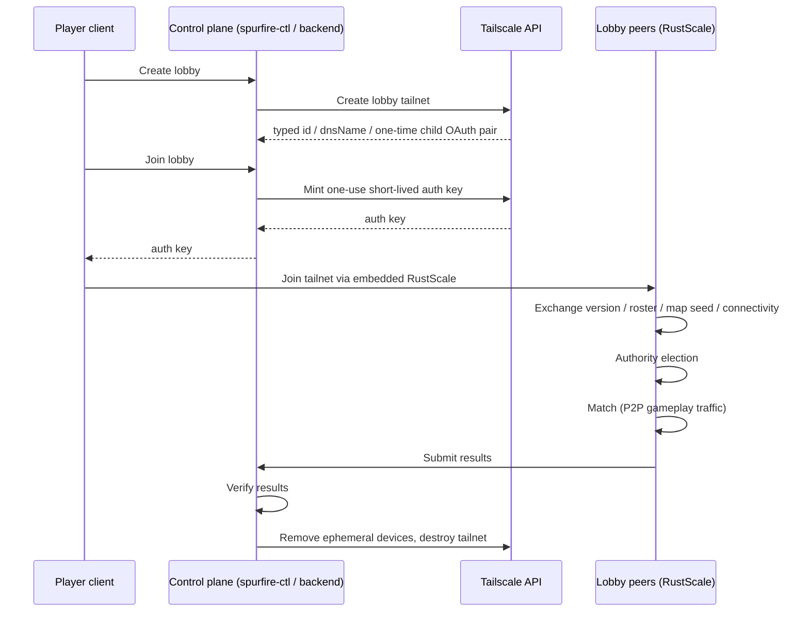

# Spurfire Architecture

Spurfire splits cleanly into a **control plane** (this repo) and a **data plane** (the game
clients). Only real-time gameplay traffic is peer-to-peer; everything administrative flows
through the control plane.

## Control plane (this repo)

- **`spurfire-control`** — library crate wrapping the Tailscale API: lobby tailnet
  provisioning, one-use auth-key minting, ephemeral device cleanup, tailnet teardown.
- **`spurfire-ctl`** — shared-tailnet development/operations CLI. It deliberately refuses
  tailnet-per-lobby creation because it will not persist child OAuth credentials.
- **`spurfire-server`** — Axum lobby service handling provisioning metadata, one-use credential
  issuance, cleanup, and prototype results. There is no permanent dedicated gameplay server.

## Data plane (game clients)

- Game clients embed **RustScale** (a sibling repo, `rustscale`) to join the lobby tailnet
  directly — all gameplay machines are peers.
- **Peer-hosted authority**: one player is elected **match authority** and validates movement,
  shots, damage, score, and events. Election inputs include direct-connection count,
  median/worst latency, jitter, packet loss, upload stability, device performance, and relay
  status. Peers keep recent state snapshots for authority migration.

## Trust boundaries

- **Tailscale organization OAuth credentials** (`TS_CLIENT_ID` / `TS_CLIENT_SECRET`) exist
  **only in the control plane**. A created child tailnet's one-time OAuth pair is held only in
  the provider's in-memory vault in this prototype; it is never durable or client-visible. The
  production design requires an encrypted secret manager and restart reconciliation.
- Game clients receive **one-use, short-lived auth keys** scoped to a single lobby tailnet.
  Joining a lobby grants tailnet access only — never API access.
- Match results cross the boundary back into the control plane for verification before they
  count toward persistent leaderboards.

## Lobby lifecycle

1. Player creates a lobby.
2. Tailnet-per-lobby mode creates an API-only organization child and vaults its child OAuth pair; shared mode selects the configured shared tailnet.
3. One-use, short-lived credential is minted in the selected scope per player.
4. Clients join via embedded RustScale.
5. Peers exchange version, roster, map seed, connectivity measurements.
6. Authority host elected.
7. Match runs (peer-to-peer gameplay traffic only).
8. Results submitted and verified.
9. Peers disconnect; shared resources are cleaned by tag, or the API-only child tailnet is deleted and its vault entry evicted.

## Connection display model

Connection routes are peer-specific and can change live. The UI labels each route:

- **Direct** — peer-to-peer with no relay.
- **Peer Relay** — routed through another peer.
- **DERP Relay** — routed through Tailscale DERP relays (fallback).

The lobby shows a network health summary (peers direct, median/worst RTT, authority
candidate). The in-match scoreboard's network metric is **latency to authority**; an expanded
panel shows the full peer matrix.

## Note on RustScale

`rustscale` is a **sibling repo under active development**, not part of this workspace. When
data-plane bugs appear (connectivity, relay behavior, tailnet joins), the fault may live in
RustScale rather than in this repo — check there before debugging the control plane.
