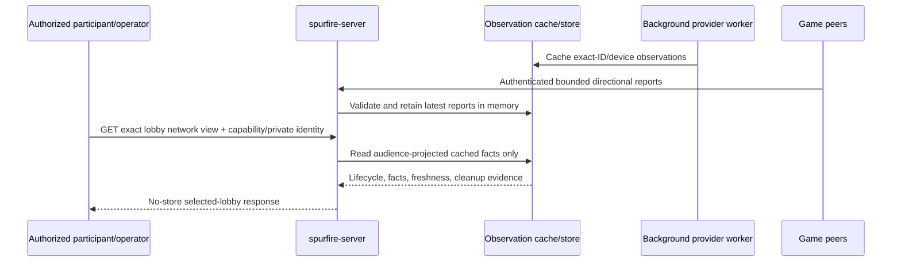

# Spurfire architecture

Spurfire separates a **control plane** from a peer-to-peer **gameplay data plane**. The control plane owns provider resources and lobby metadata; game clients own real-time traffic and match execution. A dedicated lobby tailnet is an isolation boundary, not a place for the control service to run.

Public real-network activation is closed. The accepted target and exact gates are in [control-plane-network-view.md](control-plane-network-view.md); Ottawa remains forced dry-run.

## Components

### Control plane (this repository)

- **`spurfire-control`** — typed Tailscale API client for organization child-tailnet creation/listing, narrow auth-key operations, coarse device inventory, and exact child-scoped deletion.
- **`spurfire-server`** — Axum lobby service for durable control intent, idempotency, credential issuance receipts, deterministic election records, and cleanup. Safe groundwork adds exact provider identity, a singleton real-lobby lease, cached provider observations, and a creator-capability selected-lobby view; complete route authorization/reconciliation remains gated. It is not in the gameplay path.
- **`spurfire-ctl`** — development/operator HTTP client. It does not persist child OAuth material and must not enroll as a lobby peer.
- **Dynamic encrypted vault (activation requirement)** — holds one-time child OAuth material under workload identity and audit. The prototype has only a process-local, zeroizing vault, so restart recovery is fail-closed and public real activation is blocked.

### Gameplay data plane

- Game clients embed pinned **RustScale** from the sibling repository and enroll directly with one-use, short-lived lobby credentials.
- Clients exchange application UDP peer-to-peer. RustScale can select Direct, Peer Relay, or DERP Relay paths independently in each direction.
- One player is peer-hosted match authority and validates movement, shots, damage, score, and events. There is no permanent dedicated gameplay server.
- Clients will produce bounded directional path/application-quality reports for the protected inspector. Those reports are authenticated to an ephemeral lobby participant but remain untrusted claims.

## Dependency direction

```text
provider control API <--- spurfire-control <--- spurfire-server ---> durable control store
                                                  |
                                                  +---> encrypted child vault (required)
                                                  +---> cached selected-lobby view

Godot game ---> spurfire-protocol / spurfire-net ---> embedded RustScale ---> lobby peers
     |
     +-- HTTPS control requests and bounded participant reports --> spurfire-server
```

The control plane can share wire DTOs with clients, but `spurfire-server` must not depend on RustScale, `spurfire-net`, a gameplay listener, relay, or observer-node runtime. CI must enforce that boundary before activation. A provider API call controls a network; it does not make the caller a member of that network.

## Ownership versus membership

Dedicated `tailnet_per_lobby` is the selected real isolation path. For one lobby, control-plane ownership comprises:

1. atomically reserving the single real-lobby lease and durable create intent;
2. creating one provider child tailnet;
3. binding `lobby_id`, network generation, provider stable ID, and the provider-returned tailnet DNS name/FQDN;
4. committing child OAuth material to a dynamic encrypted vault;
5. issuing one-use, short-lived participant enrollment credentials;
6. refreshing scoped provider observations in background workers and accepting bounded participant reports;
7. reconciling store, vault, lease, and exact upstream identity after startup/failure;
8. deleting under the matching child scope, proving exact stable-ID absence, erasing the child secret, and releasing the lease.

The main control plane **never joins**. Membership would add private node-state custody, peer-facing sockets, cross-tailnet compromise reach, observer-biased measurements, false device counts, and cleanup complexity. It would not reveal player-to-player application RTT or route truth. Speaking gameplay would also make the service a participant/witness and violate the peer-hosted boundary. This is accepted as D9, not an implementation convenience.

A future break-glass observer is not part of this architecture. It requires a separate process, separate ADR, one selected lobby, a 120-second maximum, and non-authoritative output; it is not permitted in Ottawa.

## Provisioning modes

| Mode | Isolation/truth label | Role |
|---|---|---|
| `dry_run` | `SIMULATED — NO TAILNET EXISTS` | Zero provider mutation; simulates the dedicated path without inventing an FQDN |
| `tailnet_per_lobby` | `REAL — DEDICATED TAILNET` | Preferred real path: one exact provider tailnet per lobby |
| `shared_tailnet` | `REAL — SHARED COMPATIBILITY` | Separately configured compatibility path with lobby tags/ACLs; never presented as dedicated |

The alpha real-lobby quota is one across both real modes. Shared compatibility cannot bypass the lease or other real-lobby safety controls. Public real mode, if separately activated, accepts only server-selected `tailnet_per_lobby`.

## Trust boundaries

### Credentials and capabilities

- Parent organization OAuth credentials exist only in `spurfire-control`/`spurfire-server` through an approved secret path.
- Child OAuth credentials are control-plane-only. The current process-local vault is not production custody; activation requires a dynamic encrypted vault and startup reconciliation.
- Clients receive only narrowly scoped, one-use, short-lived enrollment keys. A key is returned once; durable state keeps only a non-secret receipt.
- Tailnet membership grants data-plane connectivity, not provider API access or player identity.
- Lobby capabilities are opaque, expiring, exact-lobby grants. Durable state stores only domain-separated verifiers and bindings. A lobby ID or client-asserted player ID is not a capability.
- No OAuth material, auth key, bearer token, capability plaintext, device private key, or decrypted secret appears in a response, URL, CLI argument, log, metric, public DTO, or durable JSON record.

### Metadata and observations

The complete `tailnet_dns_name` is a provider-returned FQDN (for example, `tail9a1c23.ts.net`). Its TLD is `.net`; `.ts.net` is not a TLD. FQDNs and private tailnet addresses are non-secret topology metadata, but capability and retention policy still protect them.

Observation does not imply authority:

- control-store lifecycle is authoritative only for recorded service intent/state;
- provider stable ID/FQDN is authoritative only for provider resource identity;
- provider device listing is an observation of enrollment at poll time, not player binding or application health;
- provider `lastSeen` is coarse metadata, not a verified online boolean;
- participant route/RTT/loss/authority rows are reported, directional, and potentially false;
- deterministic election output is authoritative only as formula application over identified inputs;
- accepted heartbeat is authoritative only as a receipt event;
- ranked results remain unresolved under D5.

Every selected-lobby value carries source, assurance, observation/receipt time, and freshness. Collection failure preserves the last good value as stale or yields unknown; it never manufactures offline, zero, unavailable, or absent.

## Target selected-lobby inspection flow



The inspection GET performs no provider I/O or mutation. Public users have no real-lobby selector or directory. A participant capability selects exactly its bound lobby; an operator can use a private minimal list and then selects one exact lobby. Provider-only identity/reconciliation fields are omitted from participant output.

Requested observables come from distinct sources:

- **Lifecycle/cleanup:** durable network events and reconciliation results, independent of lobby state.
- **Enrollment:** child-scoped provider device list at a successful poll.
- **Health:** provider metadata stays coarse/unknown; fresh participant application reports describe application reachability.
- **Routes:** each reporter's latest directional RustScale path class: Direct, `Relay` shown as **Peer Relay**, DERP shown as **DERP Relay**, and `None` shown as Unavailable.
- **Application RTT/loss:** bounded application nonce/reply and sequence-window measurements. DERP-region, WireGuard/discovery, election, or observer latency is not application RTT.
- **Authority:** formula result, accepted heartbeat receipt, and peer-reported current match authority/epoch/agreement are displayed separately.
- **Freshness:** service receipt and provider poll-completion times, never untrusted peer wall clocks.

See the [network-view contract](control-plane-network-view.md#network-view-contract) for schemas, audience projection, anti-spoofing, retention, and test requirements.

## Independent lifecycles

The lobby lifecycle (`PROVISIONING` through `DESTROYED`) describes the lobby record and gameplay coordination. A separate network lifecycle describes provider intent/resource evidence:

```text
SIMULATED
RESERVED -> CREATING -> ACTIVE
                     \-> CREATE_REJECTED
                     \-> CREATE_UNKNOWN -> MANUAL_REMEDIATION
ACTIVE -> CLEANUP_REQUESTED -> CLEANUP_PENDING -> VERIFYING_ABSENCE
       -> DEDICATED_ABSENT
```

Shared compatibility terminates at `SHARED_RESOURCES_CLEAN`; the shared tailnet remains. Any identity/custody conflict enters `MANUAL_REMEDIATION`. `LobbyState::DESTROYED` does not prove `DEDICATED_ABSENT`.

Dedicated absence requires two parent-organization listings at least five seconds apart in which the exact stored stable ID is absent, followed by verified encrypted-secret erasure. Delete 200/404 alone is only an acknowledgement.

## Target protected lobby and match lifecycle

1. A creator obtains one exact lobby capability. A real create also consumes an operator-issued one-use grant and atomically reserves the real-lobby lease before provider work.
2. Dry-run simulates the dedicated path; real dedicated mode creates and binds one child tailnet; shared mode remains explicit compatibility.
3. A one-use invitation is consumed on join. The first successful join returns a one-use enrollment key and participant capability; replay returns receipts only.
4. Game clients enroll through embedded RustScale and exchange version, roster, map seed, and connectivity/application measurements.
5. A match authority is elected using the shared deterministic formula.
6. Gameplay runs peer-to-peer. The control service is not required for packet flow or mid-match survival.
7. Results may be submitted for shallow validation, but no ranked trust is claimed under D5.
8. Cleanup records intent, removes dedicated/shared resources, and retains the lease until the mode-specific proof is complete.

## Peer-hosted authority and gameplay milestones

D6 remains the networking rule: on authority silence, surviving peers recompute `election_v1` over the match-start measurement matrix restricted to the survivor set. The control plane may independently recompute/validate a successor receipt; it does not choose a mid-match authority. The lowest-connected-ID rule is only the degraded fallback inside the same function.

Peers retain state for migration. D7 keeps authority-side rewind over roughly 250 ms of position/stance history, capped at 150 ms, with no special authority-player shooting path.

This control-plane groundwork does not reorder gameplay development. The strict M0–M6 ladder in [prototype-plan.md](prototype-plan.md) remains authoritative: the M6 spine was built early, but remaining gameplay/network-loop completion waits for the M5 fun verdict.

## Failure posture

- Ambiguous create, restart, provider polling, vault deletion, identity mismatch, or cleanup failure holds the one-real-lobby lease and closes new real mutations.
- Startup is mutation-closed until store, encrypted vault, lease, and exact upstream identities reconcile.
- An orphan is quarantined. Automation never guesses a credential or deletes by display name.
- Cleanup uses the matching child credential and validated FQDN, then proves exact stable-ID absence and erases encrypted custody before release.
- Ottawa has no provider credential, no persistence, and forced dry-run. A separate reviewed GitOps change is required after every activation gate passes.

## Note on RustScale

`rustscale` is an actively developed sibling repository, not part of this workspace. Its current route classes are `Direct`, `Relay`, `Derp`, and `None`; the inspection contract maps them to Direct, Peer Relay, DERP Relay, and Unavailable. Any future report bridge must re-audit the pinned Spurfire revision and avoid linking RustScale into `spurfire-server`. Connectivity, relay, enrollment, and platform defects may live in RustScale rather than the control plane.
